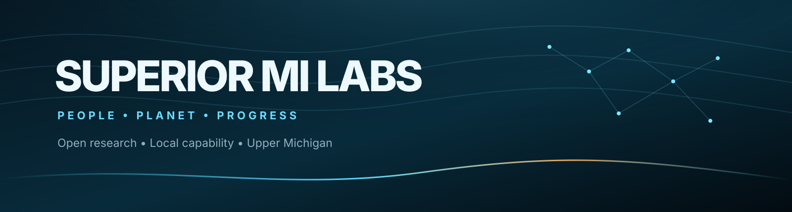

  

<h1 align="center">Superior MI Labs</h1>

  <strong>Open research. Real engineering. Upper Michigan.</strong>

  Exploring local-first AI systems, inference architecture,
  adaptive computation, intelligent interfaces, and the infrastructure
  needed to understand and build them.

  
  

---

Superior MI Labs is an early-stage research and development effort based in
Upper Michigan.

We are interested in intelligent systems that are understandable enough to
inspect, measurable enough to challenge, modular enough to evolve, and useful
enough to matter outside a benchmark.

Our work currently centers on AI inference systems, reusable computation,
adaptive runtimes, reasoning and decision infrastructure, intelligent
interfaces, and local compute.

## Current public work

### AIR

**Adaptive Inference Runtime**

AIR is a standalone C++20 inference runtime built around explicit ownership,
bounded resources, observable state, and falsifiable optimization.

It currently includes reference/CPU and NVIDIA CUDA execution paths, GGUF model
loading within its qualified scope, bounded scheduling and backpressure,
generation, runtime observability, a semantic Decision interface, and a local
browser command center.

  <a href="https://github.com/Superior-MI-Labs/AIR"><strong>Source and engineering record</strong></a>
  &nbsp;•&nbsp;
  <a href="https://superior-mi-labs.github.io/AIR/"><strong>Project site</strong></a>
  &nbsp;•&nbsp;
  <a href="https://huggingface.co/spaces/Superior-Mind-Labs/AIR"><strong>Hugging Face Space</strong></a>

### Superior MI Builder

**Typed construction substrate for machine-readable systems**

Superior MI Builder is the structural substrate for composing, verifying, lowering, simulating, and safely evolving typed systems through one canonical graph authority and one structural mutation path.

R1 completed an eight-wave development and destructive-qualification program covering canonical graph histories, exact artifact identity, deterministic verification, state isolation, explicit effect authority, safe simulation, runtime fault evidence, and a clean-room fresh-agent proof.

  <a href="https://github.com/Superior-MI-Labs/Superior-MI-Builder"><strong>Source and R1 engineering record</strong></a>

### Inference Fabric

Inference Fabric explores reusable inference infrastructure, continuity, and
ways to reduce unnecessary repeated computation while keeping execution state
and system boundaries explicit.

  <a href="https://github.com/Superior-MI-Labs/inference-fabric"><strong>Explore Inference Fabric</strong></a>

## Research direction

Superior MI Labs is building toward a larger modular research ecosystem.

Areas of active or developing interest include:

- inference architecture and hardware-aware execution
- adaptive runtime systems
- reasoning and decision infrastructure
- reusable computation and continuity
- intelligent interfaces and sensorimotor systems
- local AI and compute infrastructure
- developer and agent tooling
- system observability, deterministic replay, and qualification
- practical applications of advanced AI systems

Not every research effort is public or release-ready. We try to distinguish
between ideas under investigation, experimental systems, qualified public
software, and mature products.

## How we build

A few principles show up repeatedly in our work:

**Make state explicit.**  
Important behavior should not disappear into hidden mutable layers.

**Keep one authority for each responsibility.**  
Parallel pipelines and duplicate sources of truth create systems that become
hard to reason about.

**Measure before claiming.**  
Optimizations and architectural ideas should survive testing, comparison, and
falsification.

**Design for evolution.**  
Components should be modular enough to replace, improve, or specialize without
forcing the entire system to be rewritten.

**Preserve the evidence.**  
Failures, negative results, benchmarks, qualification records, and discarded
approaches are part of the research record.

## Why Upper Michigan?

Advanced technical research does not have to be something communities like
ours only consume from somewhere else.

Superior MI Labs is being developed with the long-term goal of helping build
technical capability in Upper Michigan while contributing useful work to the
broader open research community.

Lake Superior and the surrounding region are part of the identity of the lab,
not just its visual branding.

## Elsewhere

**GitHub**  
https://github.com/Superior-MI-Labs

**Hugging Face**  
https://huggingface.co/Superior-Mind-Labs

---

  <strong>People • Planet • Progress</strong> 
  Superior MI Labs

